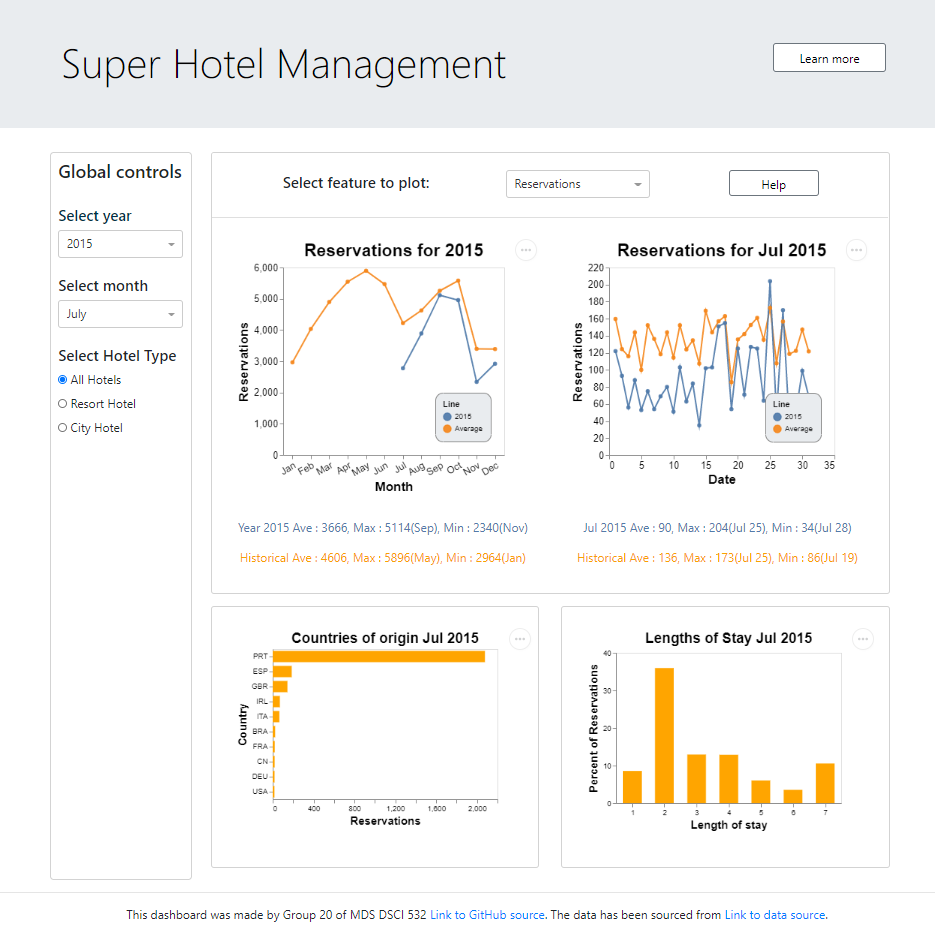

# Super Hotel Management

[View Dashboard](https://super-hotels.herokuapp.com/)

The intent of this app is to display the key metrics and trends of hotel booking demand in Portugal and further allow users to explore different aspects of this data by filtering different variables to better understand customer's needs. A preview of the dashboard can be seen below:

Users can select the year, month and hotel type they are interested in by using the respective drop down menus and radio button from global control. These filters will be applied on the entire dashboard including summary cards. Once these fields are filled out, the page will populate several plots with aggregated data that the user can explore in greater detail.

There is also a further option to select features such as reservations, average daily rate etc. from the top horizontal filter which controls the top two trend charts. The summary card will also change as per selection. The main functionality of this dashboard is to provide a more detailed look at monthly/daily trends, origin of the countries to identify the key location of customers and length of stay at the hotel.

# Get Involved

We are always looking for feedback and contributors! You can run the app locally and contribute by:

1.	Forking this repo
2.  Installing the enviornment by using `environment.yaml`
3.	Adding your improvements to the app.py file in the `src/` folder
